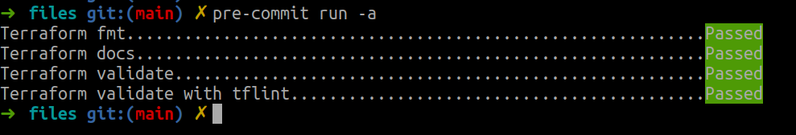
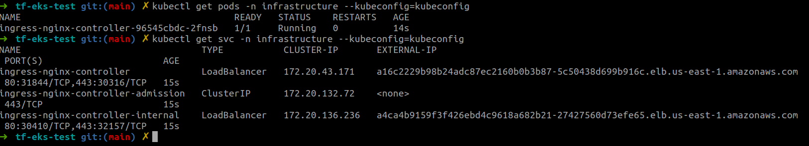
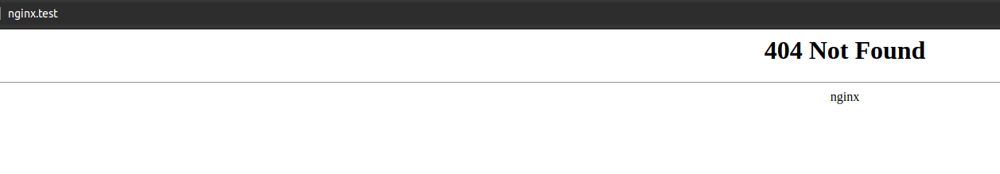

# tf-eks-test

Task to bootstrap EKS cluster with helm chart inside.

## Components

- VPC
- EKS
- K8S namespace
- nginx-ingress with private loadbalancer deployed in created namespace

## Results

